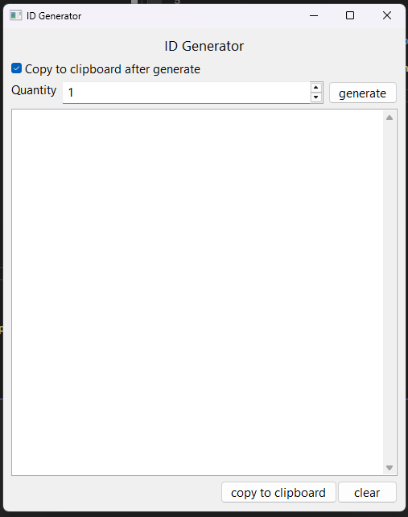

# GenID
Aplicação para a geração de IDs utilizando o timestamp da data e hora atual. A aplicação foi construída utilizando wxWidgets e testada apenas em ambiente Windows.

A aplicação conta com uma interface a qual permite que o usuário selecione a quantidade de ids a serem gerados, em um intervalo de 1 a 100, e disponibiliza a opção de copiar para a área de tranferência (ctrl + c).